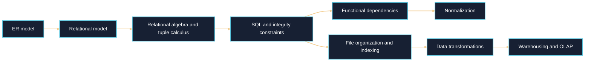

# Database-Management

[Table of Contents](#table-of-contents)  
* [Books](#books)  
* [NPTEL and MOOCs Courses](#course)  
* [Notes](#notes)  
* [Articles](#articles)  
* [Practice Problems](#practice-problems)

<!-- subject-diagram:start -->
## Interactive Concept Map

Open the Mermaid diagram viewer on GitHub to pan and zoom through this original
subject map.

Diagram style follows a visual-first progression inspired by [3Blue1Brown](https://www.3blue1brown.com/).
<!-- subject-diagram:end -->

---

## Books

Explore these recommended books to enhance your understanding:

<!--
- [**"All of Statistics: A Concise Course in Statistical Inference"**](https://egrcc.github.io/docs/math/all-of-statistics.pdf) by  Larry Wasserman 
  A comprehensive resource for statistical theory and its applications.
-->
- [**"Fundamentals of Database Systems (7th Edition)"**](./data/Database-Management/Fundamentals_of_Database_Systems_(7th_Edition).pdf) by Ramez Elmasri & Shamkant B. Navathe \
  A comprehensive resource covering database design, ER modeling, relational algebra, SQL, normalization, indexing, transaction processing, distributed databases, and data warehousing.
- [**"Data Mining Book (Third Edition)"**](https://www.sku.ac.ir/Datafiles/BookLibrary/43/Data-Mining-Concepts-and-Techniques-Han.pdf) \
  Jiawei Han(University of Illinois at Urbana–Champaign),Micheline Kamber,Jian Pei(Simon Fraser University)\
  A comprehensive resource for theory and its applications.
- [**"Introduction to Data Mining (Second Edition)"**](https://www-users.cse.umn.edu/~kumar001/dmbook/index.php) by Tan, Steinbach, Kumar, & Karpatne,

---

## NPTEL and MOOCs Courses

Course to deepen your knowledge:

- **[Data Base Management System- IITKGP](https://www.youtube.com/playlist?list=PLIwC9bZ0rmjSkm1VRJROX4vP2YMIf4Ebh)** :NPTEL Course widely appreciated for DBMS
- **[DBMS COURSE NPTEL covering both Data Mining and Data Warehousing Concepts](https://www.youtube.com/playlist?list=PL9426FE14B809CC41)**  Lecture Series on Database Management System by Prof.D.Janakiram, Department of Computer Science and Engineering,  IIT Madras  Dr. S. Srinath, IIIT Bangalore.

---

## Notes

Review these comprehensive notes to reinforce your grasp:
-  Database Management Systems by MIT: **[6.830 Database Systems](https://ocw.mit.edu/courses/6-830-database-systems-fall-2010/pages/lecture-notes/)** The Notes are pretty comprehensive and include a syllabus for DBMS asked in the GATE Exam
-  Lecture notes on DBMS by UC Berkely: **[CS 186 UC Berkely](https://inst.eecs.berkeley.edu/~cs186/sp08/notes.html)** The course website contains notes for the portion of the syllabus which is identical to GATE DS/AI Syllabus
-  Data Mining Notes from CMU: **[Data Mining: Spring 2013](https://www.stat.cmu.edu/~ryantibs/datamining/)** The Data Mining offering contains some section which is part of the syllabus, furthermore some of the handout here contains material which might be helpful to prepare other sections ie ML
- **[Indexing:File Organization](https://www2.seas.gwu.edu/~bhagiweb/cs2541/lectures/indexing.pdf)** Taken from George Washington University Course CS 2451
---

## Articles
 
Read insightful articles to gain additional insights:

- **[SQL Cheatsheat](https://www.datacamp.com/cheat-sheet/sql-basics-cheat-sheet)** Data Camp
- **[DBMS Normalization examples](https://www.freecodecamp.org/news/database-normalization-1nf-2nf-3nf-table-examples/)** 

---

## Practice Problems

Test your knowledge and skills with these practice problems:
- **[Gate CSE PYQ on DBMS](https://practicepaper.in/gate-cse/database-management-system)**
- **[SQL Practice](https://github.com/wangruinju/SQL_Resources/blob/master/Stanford%20SQL%20practice/SQL%20exercise.Rmd)** A standard GitHub repo containing good variety of questions on SQL Query
- **[Stanford CS145: Introduction to Databases](https://web.stanford.edu/class/cs145/)** for database course material and exercises.
  
---

#### Table of Contents

* [Books](#books)  
* [NPTEL and MOOCs Courses](#course)  
* [Notes](#notes)  
* [Articles](#articles)  
* [Practice Problems](#practice-problems)
